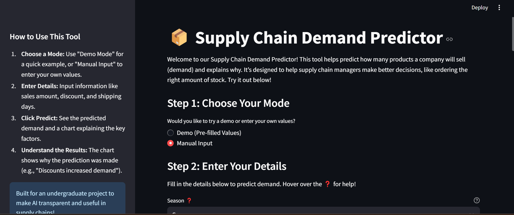
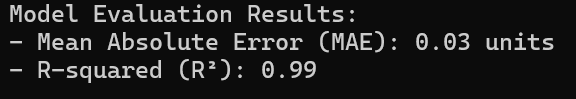

---

# Supply Chain XAI Dashboard

 

*A user-friendly Explainable AI (XAI) tool for demand forecasting in supply chain management.*

---

## 🚀 Project Overview

### 📌 What Is This Project?
This dashboard is an undergraduate capstone project that combines machine learning and explainable AI to solve a real-world supply chain problem: **demand forecasting**. 

Unlike traditional black-box models, this tool not only predicts how many units will be sold, but also **explains why** the prediction was made, using SHAP (SHapley Additive exPlanations). It’s designed for **non-technical users** like supply chain managers and business owners.

### 💡 Why It Matters
- **Avoid Overstocking:** Reduce waste and inventory costs.
- **Prevent Stockouts:** Improve customer satisfaction and sales.
- **Make Informed Decisions:** Understand the factors behind demand (e.g., discounts, seasons).

### 🎯 Who Benefits?
- **Supply Chain Professionals** – for smarter inventory planning.
- **Business Stakeholders** – to optimize sales and reduce losses.
- **Students/Researchers** – to learn about applied AI and XAI.

This project supports the academic vision of transparency and ethical AI use in business-critical applications.

---

## 🧠 How It Works

### 1. 📊 Dataset
We use the **DataCo SMART SUPPLY CHAIN Dataset**, which includes:
- Order and sales dates
- Product categories (e.g., apparel, electronics)
- Discounts, quantities, shipping times

📂 Download the dataset:
- [Kaggle](https://www.kaggle.com/datasets/shashwatwork/dataco-smart-supply-chain-for-big-data-analysis/data)
- [Mendeley](https://doi.org/10.17632/8gx2fvg2k6.3)

🔑 Key features used:
- `DateOrders` → Season
- `Sales` → Order value
- `Order Item Discount`
- `Days for shipping (real)`
- **Target:** `Order Item Quantity`

---

### 2. 🤖 AI Model
- **Model Used:** XGBoost Regressor
- **Explainability:** SHAP for global and local feature attribution

### 3. ⚙️ Backend
- **Framework:** FastAPI
- **Role:** Hosts prediction endpoints (`/predict`, `/explain`)

### 4. 🌐 Frontend
- **Framework:** Streamlit
- **Role:** Simple UI to input order details and visualize predictions + SHAP plots

---

## 🛠️ Installation & Setup

### 📦 Prerequisites
- Python 3.8+
- Git
- Virtual Environment (recommended)

### 🔧 Installation Steps

```bash
# Clone the repo
git clone https://github.com/Akobabs/supply-chain-xai.git
cd supply-chain-xai

# Create and activate a virtual environment
python -m venv venv
# Windows
venv\Scripts\activate
# macOS/Linux
source venv/bin/activate

# Install dependencies
pip install -r requirements.txt
````

### 📁 Place the Dataset

Download `DataCoSupplyChainDataset.csv` from Kaggle or Mendeley and place it in:

```
supply-chain-xai/backend/data/DataCoSupplyChainDataset.csv
```

---

## 📂 Project Structure

```
supply-chain-xai/
├── backend/
│   ├── data/                     # Dataset
│   ├── demand_model.json         # Trained model
│   ├── evaluate_shap.py          # SHAP analysis
│   ├── main.py                   # FastAPI app
│   ├── model.py                  # Training script
│   ├── preprocess.py             # Feature engineering
│   ├── predictions.log           # Logs
├── frontend/
│   ├── app.py                    # Streamlit dashboard
├── README.md
```

---

## ▶️ Usage Guide

### Step 1: Start Backend (FastAPI)

```bash
cd backend
# Activate virtual environment if not already
python model.py                # Train and save model
uvicorn main:app --reload     # Starts API at http://localhost:8000
```

### Step 2: Start Frontend (Streamlit)

```bash
cd frontend
streamlit run app.py          # Opens app in browser at http://localhost:8501
```

### Step 3: Try It Out!

🔍 **Demo Mode:**

* Pre-filled values to explore SHAP explanations.

🧾 **Manual Input:**

* Season (Winter, Spring, etc.)
* Sales Amount (e.g., \$150)
* Discount (e.g., \$20)
* Days for Shipping (e.g., 3)

📈 **Output:**

* Predicted demand
* SHAP chart showing feature impact

---

## 📊 Evaluation



### ✅ Solution Effectiveness

* **Ease of Use:** Intuitive interface via Streamlit
* **Transparency:** SHAP plots for trust in predictions
* **Business Value:** Prevents costly misjudgments in demand planning
* **Ethical Compliance:** GDPR-conscious, prediction logs, bias control

---

## 🔭 Future Enhancements

* 📈 Add more features (e.g., weather, product category)
* 📜 Track prediction history in UI
* 🚛 Extend use cases to delivery optimization or inventory alerts

---

## 👨‍💻 Author

**Akobabs** – [@Akobabs on GitHub](https://github.com/Akobabs)

---

## 📚 Acknowledgments

* **Dataset Authors:** Fabian Constante, Fernando Silva, and António Pereira
* **XAI Inspiration:** Research by Baryannis et al. (2019) and Doshi-Velez & Kim (2017)

---

## 📝 License

This project is licensed under the MIT License. See [`LICENSE`](LICENSE) for more information.

````

---